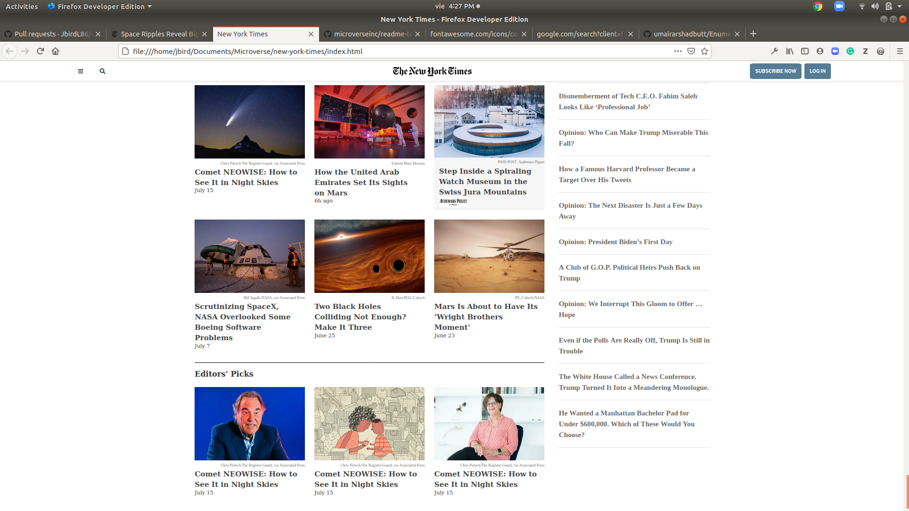

# New York Times

> This is a Microverse project for students. It involves the use of several positioning techniques like float, position absolute, position relative, grid, flex. For the
  navigation bar I used a flex container, for the image of the "Theory of inflation" article I used position relative and absolute, for the grilled sugested posts at the 
  bottom I used a grid container, for the navigation menu at the bottom of the page I used float.

## Built With

- HTML,
- CSS,

## Live Demo

[Live Demo Link](https://rawcdn.githack.com/JbirdL86/new-york-times/59bea140a126baa298287d202d442f3b4ccb2c12/index.html)

## Getting Started

To get a local copy up and running follow these simple example steps.

### Setup

Just open your terminal and go to the directory where you want the whole folder, from that directory use the "git clone https://github.com/JbirdL86/new-york-times/tree/feature-branch" 
and thats it.

## Authors

👤 **Author1**

- Github: [@githubhandle](https://github.com/JbirdL86)
- Twitter: [@twitterhandle](https://twitter.com/JuanLui06498455)
- Linkedin: [linkedin](https://www.linkedin.com/in/juan-luis-0551921aa/)

## 🤝 Contributing

Contributions, issues and feature requests are welcome!

Feel free to check the [issues page](issues/).

## Show your support

Give a ⭐️ if you like this project! 

